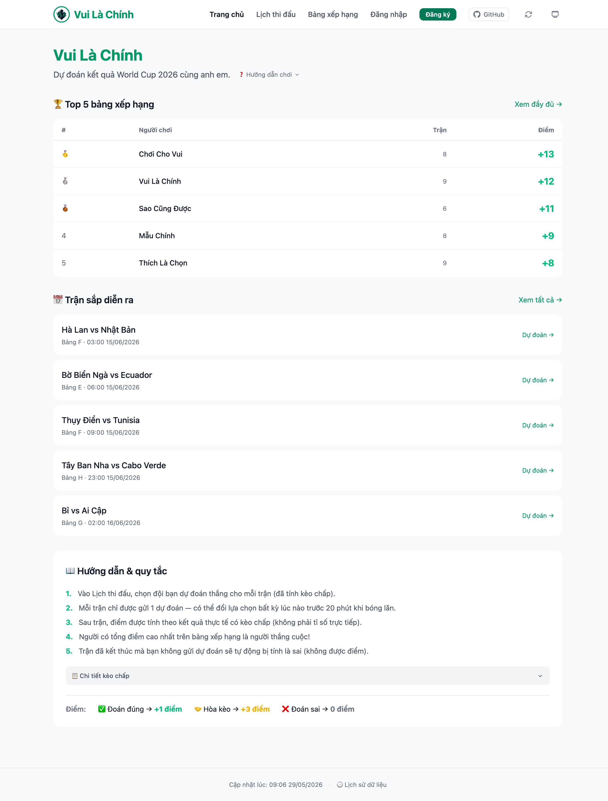

# Vui Là Chính (vuila9) ⚽

[](https://vuila9.netlify.app)
[](https://app.netlify.com/projects/vuila9/deploys)
[](./package.json)
[](./LICENSE)

Ứng dụng dự đoán kết quả bóng đá World Cup 2026 cho nhóm bạn. Static site, không backend phức tạp, dữ liệu quản lý qua Google Sheets.

🌐 **Live demo:** [vuila9.netlify.app](https://vuila9.netlify.app)



---

## Kiến trúc

```
Google Sheets (admin cập nhật kết quả & fixtures)
        │
        │  GitHub Actions — 09:00, 14:00 & 21:00 ICT
        ↓
  fetch CSV → normalize → calculate → commit src/_data/
        │
        │  Netlify auto-deploy (khi có commit mới)
        ↓
  Static site (leaderboard, fixtures, my-picks)
        │
        │  Browser fetch CSV trực tiếp (public, cache localStorage)
        ↓
  Community picks, live bets, cross-device sync

User gửi dự đoán / đăng ký:
  Browser → Netlify Function (format validation)
          → Apps Script (auth + business logic)
          → Google Sheet
```

**Stack:** Eleventy 3 · Nunjucks · Alpine.js · TailwindCSS 4 · Netlify Functions · GitHub Actions

---

## Data Model

### users
| column | type | ghi chú |
|---|---|---|
| id | string | |
| username | string | lowercase, unique |
| display_name | string | |
| passcode | string | raw — admin tạo, hash lúc build |
| passcode_hash | string | pre-computed — tự đăng ký qua web |
| created_at | datetime | |
| status | active/inactive | chỉ `active` mới login/dự đoán được |

### fixtures
`fixture_id · league · kickoff_at · home_team · away_team · handicap · status(upcoming/finished) · result_home · result_away`

### bets
`bet_id · created_at · user_id · fixture_id · pick_type(home/draw/away)`

Same user + fixture → upsert (cập nhật dự đoán cũ, không tạo mới).

---

## Tính điểm

Cấu hình trong `src/_data/siteConfig.js`:

| Kết quả | Mặc định | Khi nào |
|---|---|---|
| WIN | +3 | chọn đúng (tính điểm chấp) |
| PUSH | 0 | home/away chạm đúng ranh giới (chấp nguyên bàn) |
| LOSE | 0 | chọn sai — đổi thành `-1` để phạt |

`adj = (result_home - result_away) + handicap`
→ `adj > 0`: home thắng · `adj = 0`: hòa chấp · `adj < 0`: away thắng

Draw pick: WIN nếu `adj === 0`, LOSE nếu không — không bao giờ PUSH.

---

## Pages

| Route | Mô tả |
|---|---|
| `/` | Leaderboard preview, trận sắp diễn ra, hướng dẫn chơi |
| `/fixtures/` | Dự đoán: countdown, hover colors, tip text |
| `/leaderboard/` | Bảng xếp hạng đầy đủ |
| `/login/` | Đăng nhập (SHA-256 client-side) |
| `/my-picks/` | Lịch sử dự đoán cá nhân |
| `/register/` | Đăng ký tài khoản mới (status: inactive) |

---

## Chạy local

```bash
npm install
npm run calculate   # dùng sample data sẵn có trong data/raw/
npm run dev         # http://localhost:8080
```

Login thử: username `vui_la_9` · passcode `111111`

Xem hướng dẫn đầy đủ (local dev, Netlify CLI): [`SETUP.md`](SETUP.md)

---

## Deploy

### 1. Google Sheets + Apps Script
→ Xem [`SETUP.md`](SETUP.md) — Bước 1–5

### 2. Netlify
Kết nối GitHub repo, thêm các env vars:
```
GOOGLE_SCRIPT_URL=   # Apps Script web app URL
APP_SECRET=          # cùng giá trị với Apps Script Properties
GOOGLE_SHEET_ID=     # để function pre-check duplicate username
USERS_GID=           # GID tab users
```

### 3. GitHub Actions — Daily Sync
Thêm secrets vào GitHub repo (Settings → Secrets → Actions):
```
GOOGLE_SHEET_ID · USERS_GID · FIXTURES_GID · BETS_GID
```

> **Lưu ý:** GitHub Actions cron thường trễ 3–4 tiếng so với lịch đặt. Nên dùng external trigger (cron-job.org) để đảm bảo sync đúng giờ — đặc biệt lần sync tối (21:00 ICT) tránh chạy trễ qua nửa đêm.

→ Xem hướng dẫn chi tiết + external trigger setup: [`SETUP.md`](SETUP.md)

---

## Testing

Chạy nhanh trước khi release:

```
[ ] npm run build thành công (< 30s)
[ ] Login + logout hoạt động
[ ] Gửi dự đoán 1 trận → xuất hiện trong Google Sheet
[ ] Dark/light toggle không flash khi reload
[ ] Mobile: input không zoom, pick buttons dễ tap
```

→ Xem đầy đủ: [`TESTING.md`](TESTING.md)

---

## 🍴 Fork & Host Your Own

Muốn tự chạy phiên bản riêng cho nhóm của mình? Chỉ cần 15 phút:

1. **Fork** repo này
2. **Tạo Google Sheet** theo template trong [`SETUP.md`](SETUP.md)
3. **Deploy Google Apps Script** (`google-apps-script.js`)
4. **Deploy lên Netlify** — kết nối fork của bạn, set env vars
5. **Cấu hình GitHub Actions secrets** cho daily sync

Xem hướng dẫn từng bước: [`SETUP.md`](SETUP.md)

---

## Đóng góp

Mọi ý kiến, bug report, và PR đều được chào đón! Xem [`CONTRIBUTING.md`](CONTRIBUTING.md) để bắt đầu.

---

## Audit Trail

Mỗi lần GitHub Actions sync → commit `src/_data/*.json` → git history là snapshot đầy đủ:

```bash
git log --oneline src/_data/leaderboard.json
git diff HEAD~1 src/_data/leaderboard.json
```

Dữ liệu thô: Google Sheets → File → Version history.
